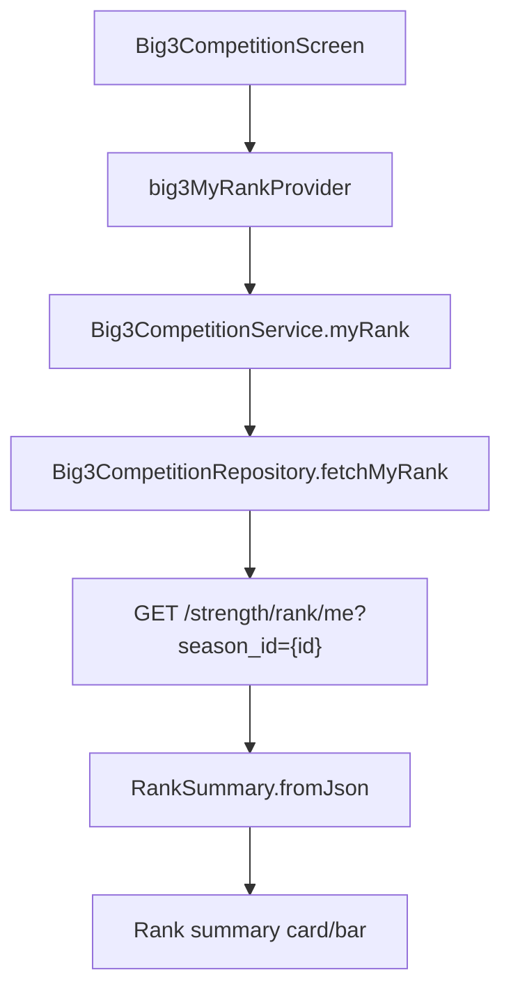

# Strength Competition Rank UX Implementation Plan

> **For agentic workers:** REQUIRED SUB-SKILL: Use superpowers:subagent-driven-development (recommended) or superpowers:executing-plans to implement this plan task-by-task. Steps use checkbox (`- [ ]`) syntax for tracking.

**Goal:** Show the user's own season rank in the Flutter strength competition screen, soften the product copy from "competition" to "season records", and prepare the UI for later submission-sheet and ratio-ranking work.

**Architecture:** Keep the current `big3_competition` feature in place for this pass. Add the missing `/strength/rank/me` client model/repository/service/provider path, then render a compact rank card/bar in the existing screen. Do not implement bodyweight-ratio ranking in this plan because the backend route does not yet accept `mode=ratio`.

**Tech Stack:** Flutter, Riverpod `FutureProvider`, FastAPI `/strength/*`, existing Dart model factories, `flutter_test`.

---

## Scope

### In Scope

- Add a Dart model for `/strength/rank/me`.
- Add repository/service methods and a Riverpod provider for my rank.
- Display the rank summary in the "내 기록" tab and a sticky-ish summary at the bottom of the leaderboard tab if simple.
- Change visible copy from "3대 경쟁" to "시즌 3대 기록".
- Improve user-facing error copy for common strength submission/profile failures.
- Add focused unit tests for rank JSON parsing and service delegation.

### Out of Scope

- `mode=ratio` backend support.
- Bodyweight ratio leaderboard UI.
- Full StateNotifier migration.
- Bottom-sheet submission refactor.
- Workout-history auto import.
- Video verification/admin review.

---

## File Map

- Modify: `lib/features/big3_competition/domain/models/big3_stats.dart`
  - Add `isComplete` helper for copy decisions.
- Create: `lib/features/big3_competition/domain/models/rank_summary.dart`
  - Parse `/strength/rank/me` response without exposing `subject` or user identifiers.
- Modify: `lib/features/big3_competition/domain/repositories/big3_competition_repository.dart`
  - Add `fetchMyRank`.
- Modify: `lib/features/big3_competition/data/big3_competition_repository_impl.dart`
  - Call `/strength/rank/me?season_id=...`.
- Modify: `lib/features/big3_competition/application/big3_competition_service.dart`
  - Add `myRank`.
- Modify: `lib/features/big3_competition/presentation/providers/big3_competition_providers.dart`
  - Add `big3MyRankProvider`.
- Modify: `lib/features/big3_competition/presentation/big3_competition_screen.dart`
  - Rename visible labels, add rank summary UI, improve error mapping.
- Modify: `lib/features/home/presentation/body_profile_screen.dart`
  - Rename entry tile and use a less trophy-like icon.
- Test: `test/features/big3_competition/rank_summary_test.dart`
  - Verify rank model parsing.
- Modify: `test/features/big3_competition/big3_competition_service_test.dart`
  - Update fake repo and add service delegation test.

---

## Design

### User Flow

1. User opens `신체 프로필`.
2. The entry is shown as `시즌 3대 기록`, subtitle `스쿼트·벤치·데드 시즌별 최고 기록`.
3. The screen title is `시즌 3대 기록`.
4. The first tab remains `내 기록`, but the content copy emphasizes season records.
5. If user is ranked, show `내 순위 12위 · 전체 84명`.
6. If not ranked, show a specific reason:
   - `not_opted_in`: `시즌 참가 후 순위를 볼 수 있어요.`
   - `leaderboard_hidden`: `순위표에서 숨김 상태예요.`
   - `incomplete_lifts`: `3종목 기록이 모두 있어야 순위가 표시됩니다.`
   - unknown: `아직 순위를 표시할 수 없어요.`

### Data Flow



### API Contract

Expected response from `GET /strength/rank/me`:

```json
{
  "season": {
    "id": "season-1",
    "slug": "2026-h1",
    "name": "2026 상반기 3대 경쟁",
    "starts_at": "2026-01-01T00:00:00Z",
    "ends_at": "2026-06-30T23:59:59Z",
    "is_active": true
  },
  "ranked": true,
  "rank": 12,
  "display_alias": "리프터-TEST",
  "reason": null,
  "records": {
    "squat_1rm_kg": 140.0,
    "bench_1rm_kg": 95.0,
    "deadlift_1rm_kg": 180.0,
    "total_1rm_kg": 415.0
  },
  "total_participants": 84
}
```

---

## Task 1: Add RankSummary Domain Model

**Files:**

- Create: `lib/features/big3_competition/domain/models/rank_summary.dart`
- Modify: `lib/features/big3_competition/domain/models/big3_stats.dart`
- Test: `test/features/big3_competition/rank_summary_test.dart`

- [ ] **Step 1: Write the failing model tests**

Create `test/features/big3_competition/rank_summary_test.dart`:

```dart
import 'package:flutter_test/flutter_test.dart';
import 'package:gains_and_guide/features/big3_competition/domain/models/rank_summary.dart';

void main() {
  group('RankSummary', () {
    test('parses ranked response', () {
      final summary = RankSummary.fromJson({
        'ranked': true,
        'rank': 12,
        'display_alias': '리프터-TEST',
        'reason': null,
        'records': {
          'squat_1rm_kg': 140.0,
          'bench_1rm_kg': 95.0,
          'deadlift_1rm_kg': 180.0,
          'total_1rm_kg': 415.0,
        },
        'total_participants': 84,
        'subject': 'must-not-be-used',
      });

      expect(summary.ranked, isTrue);
      expect(summary.rank, 12);
      expect(summary.displayAlias, '리프터-TEST');
      expect(summary.reason, isNull);
      expect(summary.totalParticipants, 84);
      expect(summary.records.total1rmKg, 415.0);
      expect(summary.statusMessage, '내 순위 12위 · 전체 84명');
    });

    test('parses incomplete lifts reason', () {
      final summary = RankSummary.fromJson({
        'ranked': false,
        'rank': null,
        'display_alias': '리프터-TEST',
        'reason': 'incomplete_lifts',
        'records': {
          'squat_1rm_kg': 140.0,
          'bench_1rm_kg': null,
          'deadlift_1rm_kg': null,
          'total_1rm_kg': null,
        },
        'total_participants': 10,
      });

      expect(summary.ranked, isFalse);
      expect(summary.statusMessage, '3종목 기록이 모두 있어야 순위가 표시됩니다.');
    });

    test('falls back for unknown reason', () {
      final summary = RankSummary.fromJson({
        'ranked': false,
        'reason': 'new_server_reason',
        'records': {},
        'total_participants': 0,
      });

      expect(summary.statusMessage, '아직 순위를 표시할 수 없어요.');
    });
  });
}
```

- [ ] **Step 2: Run test to verify it fails**

Run:

```bash
flutter test test/features/big3_competition/rank_summary_test.dart
```

Expected: fail because `rank_summary.dart` does not exist.

- [ ] **Step 3: Add `isComplete` helper to `Big3Stats`**

Modify `lib/features/big3_competition/domain/models/big3_stats.dart`:

```dart
  bool get isComplete =>
      squat1rmKg != null && bench1rmKg != null && deadlift1rmKg != null;
```

Place it after the field declarations and before `factory Big3Stats.fromBestsMap`.

- [ ] **Step 4: Implement `RankSummary`**

Create `lib/features/big3_competition/domain/models/rank_summary.dart`:

```dart
import 'big3_stats.dart';

class RankSummary {
  const RankSummary({
    required this.ranked,
    required this.rank,
    required this.displayAlias,
    required this.reason,
    required this.records,
    required this.totalParticipants,
  });

  final bool ranked;
  final int? rank;
  final String? displayAlias;
  final String? reason;
  final Big3Stats records;
  final int totalParticipants;

  factory RankSummary.fromJson(Map<String, dynamic> json) {
    final recordsJson = json['records'];
    final records = recordsJson is Map<String, dynamic>
        ? recordsJson
        : recordsJson is Map
            ? Map<String, dynamic>.from(recordsJson)
            : const <String, dynamic>{};

    return RankSummary(
      ranked: json['ranked'] == true,
      rank: json['rank'] is num ? (json['rank'] as num).toInt() : null,
      displayAlias:
          json['display_alias'] is String ? json['display_alias'] as String : null,
      reason: json['reason'] is String ? json['reason'] as String : null,
      records: Big3Stats.fromBestsMap(
        {
          'squat': records['squat_1rm_kg'] ?? records['squat'],
          'bench': records['bench_1rm_kg'] ?? records['bench'],
          'deadlift': records['deadlift_1rm_kg'] ?? records['deadlift'],
        },
        total: records['total_1rm_kg'] is num
            ? (records['total_1rm_kg'] as num).toDouble()
            : null,
      ),
      totalParticipants: json['total_participants'] is num
          ? (json['total_participants'] as num).toInt()
          : 0,
    );
  }

  String get statusMessage {
    if (ranked && rank != null) {
      return '내 순위 ${rank}위 · 전체 $totalParticipants명';
    }
    return switch (reason) {
      'not_opted_in' => '시즌 참가 후 순위를 볼 수 있어요.',
      'leaderboard_hidden' => '순위표에서 숨김 상태예요.',
      'incomplete_lifts' => '3종목 기록이 모두 있어야 순위가 표시됩니다.',
      _ => '아직 순위를 표시할 수 없어요.',
    };
  }
}
```

- [ ] **Step 5: Run model tests**

Run:

```bash
flutter test test/features/big3_competition/rank_summary_test.dart
```

Expected: all tests pass.

- [ ] **Step 6: Commit**

```bash
git add lib/features/big3_competition/domain/models/big3_stats.dart lib/features/big3_competition/domain/models/rank_summary.dart test/features/big3_competition/rank_summary_test.dart
git commit -m "feat: add strength rank summary model"
```

---

## Task 2: Wire Rank API Through Repository, Service, and Provider

**Files:**

- Modify: `lib/features/big3_competition/domain/repositories/big3_competition_repository.dart`
- Modify: `lib/features/big3_competition/data/big3_competition_repository_impl.dart`
- Modify: `lib/features/big3_competition/application/big3_competition_service.dart`
- Modify: `lib/features/big3_competition/presentation/providers/big3_competition_providers.dart`
- Modify: `test/features/big3_competition/big3_competition_service_test.dart`

- [ ] **Step 1: Update the fake repo test first**

Modify imports in `test/features/big3_competition/big3_competition_service_test.dart`:

```dart
import 'package:gains_and_guide/features/big3_competition/domain/models/rank_summary.dart';
```

Add this method to `_FakeRepo`:

```dart
  @override
  Future<RankSummary> fetchMyRank({String? seasonId}) async {
    return const RankSummary(
      ranked: true,
      rank: 3,
      displayAlias: '리프터-TEST',
      reason: null,
      records: Big3Stats(
        squat1rmKg: 100,
        bench1rmKg: 80,
        deadlift1rmKg: 120,
        total1rmKg: 300,
      ),
      totalParticipants: 20,
    );
  }
```

Add this test:

```dart
    test('loads my rank summary', () async {
      final rank = await service.myRank(seasonId: 'season-1');
      expect(rank.ranked, isTrue);
      expect(rank.rank, 3);
      expect(rank.statusMessage, '내 순위 3위 · 전체 20명');
    });
```

- [ ] **Step 2: Run service test to verify it fails**

Run:

```bash
flutter test test/features/big3_competition/big3_competition_service_test.dart
```

Expected: fail because repository/service signatures do not exist yet.

- [ ] **Step 3: Add repository interface method**

Modify `lib/features/big3_competition/domain/repositories/big3_competition_repository.dart`:

```dart
import '../models/rank_summary.dart';
```

Add to `Big3CompetitionRepository`:

```dart
  Future<RankSummary> fetchMyRank({String? seasonId});
```

- [ ] **Step 4: Add repository implementation**

Modify `lib/features/big3_competition/data/big3_competition_repository_impl.dart` imports:

```dart
import '../domain/models/rank_summary.dart';
```

Add method:

```dart
  @override
  Future<RankSummary> fetchMyRank({String? seasonId}) async {
    final path = seasonId == null
        ? '/strength/rank/me'
        : '/strength/rank/me?season_id=$seasonId';
    final json = await _api.get(path);
    return RankSummary.fromJson(json);
  }
```

- [ ] **Step 5: Add service method**

Modify `lib/features/big3_competition/application/big3_competition_service.dart` imports:

```dart
import '../domain/models/rank_summary.dart';
```

Add to `Big3CompetitionService`:

```dart
  Future<RankSummary> myRank({String? seasonId}) =>
      _repository.fetchMyRank(seasonId: seasonId);
```

- [ ] **Step 6: Add Riverpod provider**

Modify `lib/features/big3_competition/presentation/providers/big3_competition_providers.dart` imports:

```dart
import '../../domain/models/rank_summary.dart';
```

Add provider:

```dart
final big3MyRankProvider = FutureProvider<RankSummary>((ref) async {
  final season = await ref.watch(big3CurrentSeasonProvider.future);
  return ref
      .watch(big3CompetitionServiceProvider)
      .myRank(seasonId: season?.id);
});
```

- [ ] **Step 7: Run tests**

Run:

```bash
flutter test test/features/big3_competition/rank_summary_test.dart test/features/big3_competition/big3_competition_service_test.dart
```

Expected: all tests pass.

- [ ] **Step 8: Commit**

```bash
git add lib/features/big3_competition/domain/repositories/big3_competition_repository.dart lib/features/big3_competition/data/big3_competition_repository_impl.dart lib/features/big3_competition/application/big3_competition_service.dart lib/features/big3_competition/presentation/providers/big3_competition_providers.dart test/features/big3_competition/big3_competition_service_test.dart
git commit -m "feat: wire strength rank API"
```

---

## Task 3: Render Rank Summary and Rename Competition Copy

**Files:**

- Modify: `lib/features/big3_competition/presentation/big3_competition_screen.dart`
- Modify: `lib/features/home/presentation/body_profile_screen.dart`

- [ ] **Step 1: Update top-level title and tabs**

In `lib/features/big3_competition/presentation/big3_competition_screen.dart`, change:

```dart
title: const Text('3대 경쟁'),
```

to:

```dart
title: const Text('시즌 3대 기록'),
```

Keep tabs:

```dart
Tab(text: '내 기록'),
Tab(text: '리더보드'),
```

- [ ] **Step 2: Pass rank provider into both tabs**

In `build`, add:

```dart
final rankAsync = ref.watch(big3MyRankProvider);
```

Pass `rankAsync` into `_MyRecordsTab`:

```dart
rankAsync: rankAsync,
```

Pass `rankAsync` into `_LeaderboardTab`:

```dart
rankAsync: rankAsync,
```

- [ ] **Step 3: Update `_refreshAll` to invalidate rank**

Add:

```dart
ref.invalidate(big3MyRankProvider);
```

inside `_refreshAll()`.

- [ ] **Step 4: Add constructor fields**

In `_MyRecordsTab`, add:

```dart
final AsyncValue<dynamic> rankAsync;
```

Add it as a required constructor parameter.

In `_LeaderboardTab`, add:

```dart
final AsyncValue<dynamic> rankAsync;
```

Add it as a required constructor parameter.

- [ ] **Step 5: Render rank card in my records tab**

In `_MyRecordsTab.build`, insert after `_StatsCard(statsAsync: statsAsync)`:

```dart
        const SizedBox(height: 16),
        _RankSummaryCard(rankAsync: rankAsync),
```

Then create this widget in the same file:

```dart
class _RankSummaryCard extends StatelessWidget {
  const _RankSummaryCard({required this.rankAsync});

  final AsyncValue<dynamic> rankAsync;

  @override
  Widget build(BuildContext context) {
    return Card(
      child: Padding(
        padding: const EdgeInsets.all(16),
        child: rankAsync.when(
          loading: () => const LinearProgressIndicator(),
          error: (e, _) => const Text('순위를 불러오지 못했습니다.'),
          data: (rank) => Column(
            crossAxisAlignment: CrossAxisAlignment.start,
            children: [
              const Text(
                '내 시즌 순위',
                style: TextStyle(fontWeight: FontWeight.bold),
              ),
              const SizedBox(height: 8),
              Text(
                rank.statusMessage,
                style: TextStyle(
                  color: rank.ranked ? AppTheme.primaryBlue : Colors.black54,
                  fontWeight: rank.ranked ? FontWeight.w700 : FontWeight.w400,
                ),
              ),
            ],
          ),
        ),
      ),
    );
  }
}
```

- [ ] **Step 6: Add leaderboard bottom rank summary**

In `_LeaderboardTab.data`, replace the direct `ListView.separated` return with:

```dart
        return Column(
          children: [
            Expanded(
              child: ListView.separated(
                padding: const EdgeInsets.all(16),
                itemCount: entries.length,
                separatorBuilder: (_, __) => const SizedBox(height: 8),
                itemBuilder: (context, index) {
                  final e = entries[index];
                  return Card(
                    child: ListTile(
                      leading: CircleAvatar(
                        backgroundColor: AppTheme.primaryBlue,
                        foregroundColor: Colors.white,
                        child: Text('${e.rank}'),
                      ),
                      title: Text(e.displayAlias),
                      subtitle: Text(
                        'S ${e.squat1rmKg.toStringAsFixed(1)} · '
                        'B ${e.bench1rmKg.toStringAsFixed(1)} · '
                        'D ${e.deadlift1rmKg.toStringAsFixed(1)}',
                      ),
                      trailing: Text(
                        '${e.total1rmKg.toStringAsFixed(1)}',
                        style: const TextStyle(
                          fontWeight: FontWeight.bold,
                          fontSize: 16,
                        ),
                      ),
                    ),
                  );
                },
              ),
            ),
            _RankBottomBar(rankAsync: rankAsync),
          ],
        );
```

Create widget:

```dart
class _RankBottomBar extends StatelessWidget {
  const _RankBottomBar({required this.rankAsync});

  final AsyncValue<dynamic> rankAsync;

  @override
  Widget build(BuildContext context) {
    return SafeArea(
      top: false,
      child: Container(
        width: double.infinity,
        padding: const EdgeInsets.symmetric(horizontal: 16, vertical: 12),
        decoration: BoxDecoration(
          color: Theme.of(context).cardColor,
          border: const Border(top: BorderSide(color: Color(0xFFE0E0E0))),
        ),
        child: rankAsync.when(
          loading: () => const LinearProgressIndicator(),
          error: (e, _) => const Text('내 순위를 불러오지 못했습니다.'),
          data: (rank) => Text(
            rank.statusMessage,
            textAlign: TextAlign.center,
            style: TextStyle(
              color: rank.ranked ? AppTheme.primaryBlue : Colors.black54,
              fontWeight: rank.ranked ? FontWeight.w700 : FontWeight.w400,
            ),
          ),
        ),
      ),
    );
  }
}
```

- [ ] **Step 7: Rename opt-in and submission copy**

In `_OptInCard`, change:

```dart
optedIn ? '참가 중' : '미참가 (opt-in 필요)'
```

to:

```dart
optedIn ? '시즌 참가 중' : '이번 시즌 기록을 남기려면 참가가 필요해요'
```

Change button:

```dart
child: const Text('경쟁 참가하기'),
```

to:

```dart
child: const Text('시즌 참가하기'),
```

In `_StatsCard`, keep:

```dart
'시즌 최고 기록 (Epley 1RM)'
```

Change:

```dart
'3대 합산: ${_fmt(stats.total1rmKg)}'
```

to:

```dart
'시즌 합산: ${_fmt(stats.total1rmKg)}'
```

- [ ] **Step 8: Rename body profile entry**

In `lib/features/home/presentation/body_profile_screen.dart`, change import usage only; keep same screen class.

Change icon:

```dart
leading: const Icon(Icons.emoji_events_outlined, color: Colors.black54),
```

to:

```dart
leading: const Icon(Icons.timeline_outlined, color: Colors.black54),
```

Change title/subtitle:

```dart
title: const Text('3대 경쟁'),
subtitle: const Text('스쿼트·벤치·데드 시즌 리더보드 (opt-in)'),
```

to:

```dart
title: const Text('시즌 3대 기록'),
subtitle: const Text('스쿼트·벤치·데드 시즌별 최고 기록'),
```

- [ ] **Step 9: Run analyzer**

Run:

```bash
flutter analyze
```

Expected: no new analyzer errors.

- [ ] **Step 10: Run targeted tests**

Run:

```bash
flutter test test/features/big3_competition/
```

Expected: all tests pass.

- [ ] **Step 11: Commit**

```bash
git add lib/features/big3_competition/presentation/big3_competition_screen.dart lib/features/home/presentation/body_profile_screen.dart
git commit -m "feat: show strength season rank in app"
```

---

## Task 4: Improve User-Facing Strength Error Messages

**Files:**

- Modify: `lib/features/big3_competition/presentation/big3_competition_screen.dart`

- [ ] **Step 1: Expand `_friendlyError` for known server details**

Replace the `ServerException` branch in `_friendlyError` with:

```dart
    if (error is ServerException) {
      final message = error.message.toLowerCase();
      if (error.statusCode == 503) {
        return '서버 DB가 설정되지 않았습니다. DATABASE_URL을 확인해 주세요.';
      }
      if (error.statusCode == 401) {
        return '로그인이 필요합니다.';
      }
      if (error.statusCode == 409) {
        return '이미 사용 중인 닉네임이에요.';
      }
      if (error.statusCode == 400 &&
          message.contains('improvement exceeds safe weekly limit')) {
        return '이전 기록 대비 변화가 커서 저장되지 않았어요. 무게와 반복을 다시 확인해 주세요.';
      }
      if (error.statusCode == 400 &&
          message.contains('maximum 3 submissions')) {
        return '오늘은 이 종목 기록을 3회까지 제출할 수 있어요.';
      }
      if (error.statusCode == 400 && message.contains('opt-in required')) {
        return '시즌 참가 후 기록을 제출할 수 있어요.';
      }
      return '서버 오류 (${error.statusCode})';
    }
```

If `ServerException` does not expose `.message`, inspect `lib/core/error/app_exception.dart` and use the available field. Do not change `AppException` in this task unless necessary for compilation.

- [ ] **Step 2: Run analyzer**

Run:

```bash
flutter analyze
```

Expected: no new analyzer errors.

- [ ] **Step 3: Run targeted test suite**

Run:

```bash
flutter test test/features/big3_competition/
```

Expected: all tests pass.

- [ ] **Step 4: Commit**

```bash
git add lib/features/big3_competition/presentation/big3_competition_screen.dart
git commit -m "fix: clarify strength competition errors"
```

---

## Task 5: Manual QA Checklist

**Files:**

- No required code changes.

- [ ] **Step 1: Launch the app**

Run:

```bash
flutter run
```

Expected: app launches.

- [ ] **Step 2: Check body profile entry**

Navigate to `신체 프로필`.

Expected:

- Entry title is `시즌 3대 기록`.
- Subtitle is `스쿼트·벤치·데드 시즌별 최고 기록`.
- Icon is timeline-style, not trophy-style.

- [ ] **Step 3: Check not opted-in rank state**

Open `시즌 3대 기록` with a user who has not joined.

Expected:

- Screen title is `시즌 3대 기록`.
- Rank card says `시즌 참가 후 순위를 볼 수 있어요.`
- Submit buttons remain disabled.

- [ ] **Step 4: Check incomplete rank state**

Join the season and submit only one lift.

Expected:

- Rank card says `3종목 기록이 모두 있어야 순위가 표시됩니다.`
- Stats card shows the submitted lift and no total.

- [ ] **Step 5: Check ranked state**

Submit all three lifts or use a seeded account with complete lifts.

Expected:

- Rank card shows `내 순위 N위 · 전체 M명`.
- Leaderboard tab shows the same rank summary at the bottom.

- [ ] **Step 6: Commit QA note if any docs are changed**

No commit is needed if no files changed during QA.

---

## Follow-Up Plan Candidates

### Follow-Up A: Submission Bottom Sheet

- Convert the three always-visible submit cards into a single `기록 추가` action.
- Add a bottom sheet with segmented lift selector, weight field, reps field, estimated 1RM helper text.
- Keep the current repository/service code.

### Follow-Up B: StateNotifier Migration

- Replace `big3CurrentSeasonProvider`, `big3MyProfileProvider`, `big3MyStatsProvider`, `big3LeaderboardProvider`, and `big3MyRankProvider` with a single notifier state.
- Add section-level loading/error fields.
- Make mutations refresh only affected sections.

### Follow-Up C: Bodyweight Ratio Ranking

- Backend: add `mode=total|ratio` query parameter to `/strength/leaderboard` and `/strength/rank/me`.
- Backend: compute `bodyweight_ratio = total_1rm / body_weight_kg`.
- Flutter: add bodyweight field to `CompetitionProfile`.
- Flutter: add total/ratio segmented control.

---

## Verification Commands

Run before handing off:

```bash
flutter analyze
flutter test test/features/big3_competition/
```

Expected:

- `flutter analyze`: no new errors.
- `flutter test test/features/big3_competition/`: all tests pass.

---

## Self-Review

- Spec coverage: This plan covers the recommended first-pass work: rank display, copy tone, API wiring, and error copy. It intentionally excludes ratio ranking, Notifier migration, and submission bottom sheet as follow-ups.
- Placeholder scan: No `TBD`, `TODO`, or unspecified implementation steps remain.
- Type consistency: `RankSummary`, `Big3Stats`, `fetchMyRank`, `myRank`, and `big3MyRankProvider` names are consistent across tasks.
