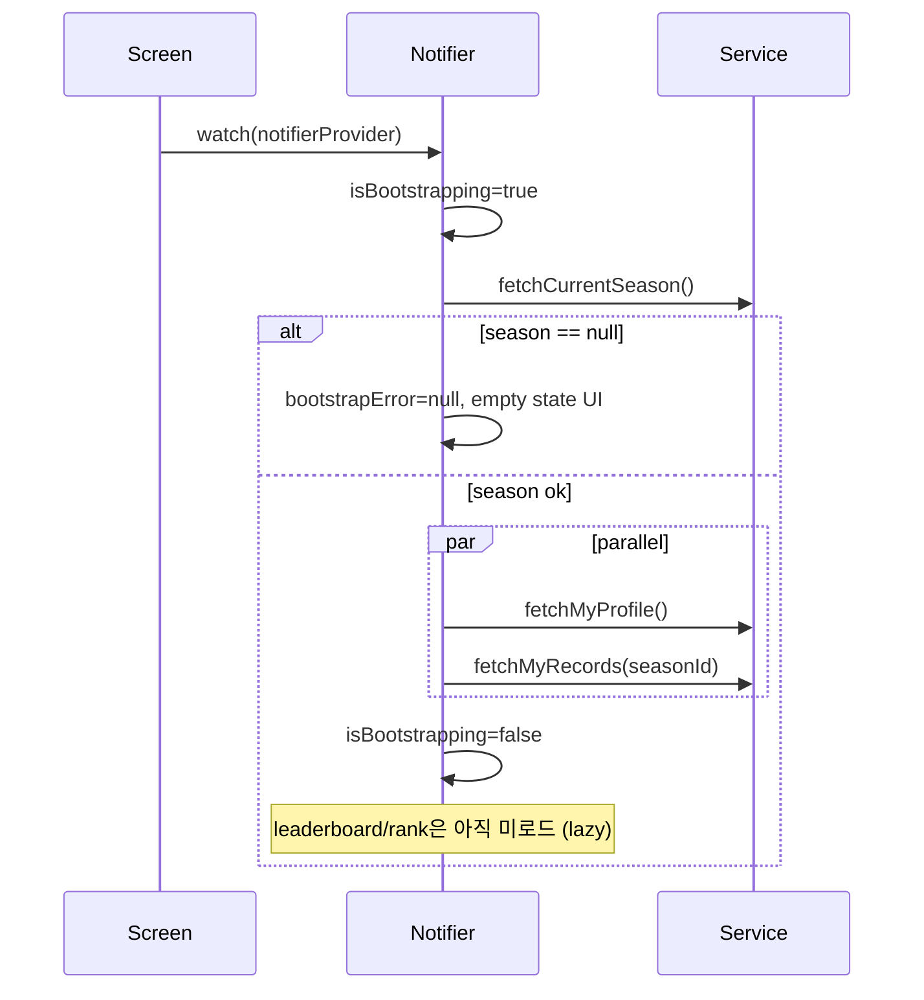

# Flutter Strength Competition — State Management Design

## Summary

단일 `StateNotifier`가 feature 전역 상태를 소유하고, 화면은 `ref.watch(strengthCompetitionNotifierProvider)`만 구독한다.  
기존 `FutureProvider` 분산 패턴(`big3_competition`)은 **필터 연동·mutation 후 일괄 갱신**이 어려워 통합 Notifier로 전환한다.

참고 패턴: `ExerciseSearchNotifier` + `ExerciseSearchState` (동일 프로젝트).

---

## Provider / Notifier 구조

```
lib/features/strength_competition/presentation/
├── state/
│   ├── strength_competition_state.dart
│   ├── strength_metric.dart
│   ├── strength_division.dart
│   └── strength_competition_ui_error.dart
├── notifiers/
│   └── strength_competition_notifier.dart
├── providers/
│   └── strength_competition_providers.dart
└── strength_competition_screen.dart
```

### Provider graph

```dart
// DI (unchanged from data layer design)
final strengthCompetitionRepositoryProvider = Provider<StrengthCompetitionRepository>(...);
final strengthCompetitionServiceProvider = Provider<StrengthCompetitionService>(...);

// Feature controller
final strengthCompetitionNotifierProvider =
    StateNotifierProvider<StrengthCompetitionNotifier, StrengthCompetitionState>(
  (ref) => StrengthCompetitionNotifier(
    ref.watch(strengthCompetitionServiceProvider),
  ),
);

// Optional: error message mapper (pure, testable)
final strengthCompetitionErrorMapperProvider = Provider<StrengthCompetitionErrorMapper>(...);
```

| Provider | Type | Role |
|----------|------|------|
| `strengthCompetitionRepositoryProvider` | `Provider` | Repository DI |
| `strengthCompetitionServiceProvider` | `Provider` | Application service DI |
| `strengthCompetitionNotifierProvider` | `StateNotifierProvider` | **단일 진실 공급원** |
| `strengthCompetitionErrorMapperProvider` | `Provider` | `AppException` → 한국어 UI copy |

**사용하지 않음:** `FutureProvider` per resource (season/profile/...) — Notifier 내부로 흡수.

---

## State class fields

```dart
class StrengthCompetitionState {
  const StrengthCompetitionState({...});

  // ── 서버 데이터 ─────────────────────────────────────────
  final StrengthSeason? currentSeason;
  final StrengthProfile? myProfile;
  final StrengthMyRecordsResult? myRecords;
  final StrengthLeaderboardPage? leaderboard;
  final StrengthRankSummary? myRank;

  // ── UI 필터 (리더보드·순위 공통) ─────────────────────────
  final StrengthMetric selectedMetric;      // total | ratio
  final StrengthDivision selectedDivision;  // overall | bodyweight | experience

  // ── 로딩 플래그 (섹션별) ─────────────────────────────────
  final bool isBootstrapping;    // 최초 진입 (season+profile+records)
  final bool isRefreshing;       // pull-to-refresh / mutation 후
  final bool isLeaderboardLoading;
  final bool isSubmitting;       // lift 제출 중
  final StrengthLiftType? submittingLift; // 어떤 종목 제출 중인지

  // ── 에러 (섹션별, partial failure 허용) ─────────────────
  final Object? bootstrapError;      // season 로드 실패 (치명적)
  final Object? profileError;        // profile opt-in/out 실패
  final Object? recordsError;
  final Object? leaderboardError;
  final Object? submitError;
  final Object? rankError;

  // ── 일회성 UI 이벤트 (snackbar) ─────────────────────────
  final StrengthCompetitionSnack? pendingSnack;

  // ── computed ───────────────────────────────────────────
  bool get hasSeason => currentSeason != null;
  bool get canSubmitLifts => myProfile?.canSubmit == true && hasSeason;
  bool get isLeaderboardVisible => myProfile?.leaderboardOptIn == true;
  StrengthLeaderboardMode get apiLeaderboardMode => ...; // §Division 매핑
  bool get isExperienceDivisionSupported => false; // MVP
}
```

### Enums

```dart
enum StrengthMetric { total, ratio }

enum StrengthDivision { overall, bodyweight, experience }

enum StrengthCompetitionSnackKind { success, info, error }

class StrengthCompetitionSnack {
  final StrengthCompetitionSnackKind kind;
  final String message;
}
```

### Division ↔ API mode 매핑 (MVP)

| `selectedDivision` | API `mode` | `selectedMetric` 동기화 |
|--------------------|------------|-------------------------|
| `overall` | `total` | `selectedMetric = total` |
| `bodyweight` | `ratio` | `selectedMetric = ratio` |
| `experience` | **미지원** | UI에 "준비 중" 배너, API 호출은 `total` fallback 또는 skip |

사용자가 metric 칩을 직접 바꾸면 division도 연동:

- `total` → `overall`
- `ratio` → `bodyweight`

`experience` 선택 시 metric 선택은 비활성.

---

## Notifier 액션 메서드

```dart
class StrengthCompetitionNotifier extends StateNotifier<StrengthCompetitionState> {
  StrengthCompetitionNotifier(this._service)
      : super(const StrengthCompetitionState()) {
    bootstrap(); // 생성 시 자동 로드
  }

  // ── Lifecycle ───────────────────────────────────────────
  Future<void> bootstrap();           // 최초 로드 (§로딩 순서)
  Future<void> refreshAll();          // season→profile→records→leaderboard/rank
  Future<void> refreshMyData();     // profile + records + rank (제출/opt-in 후)
  Future<void> refreshLeaderboard(); // 필터 변경·리더보드 탭 진입

  // ── 필터 ────────────────────────────────────────────────
  Future<void> setSelectedMetric(StrengthMetric metric);
  Future<void> setSelectedDivision(StrengthDivision division);

  // ── Profile / opt-in ────────────────────────────────────
  Future<void> optIn({String? displayAlias});
  Future<void> optOut();
  Future<void> setLeaderboardOptIn(bool visible);
  Future<void> updateBodyWeight(double? bodyWeightKg);
  Future<void> updateDisplayAlias(String alias);

  // ── Lift ────────────────────────────────────────────────
  Future<void> submitLift({
    required StrengthLiftType liftType,
    required double weightKg,
    required int reps,
    DateTime? sessionDate,
  });

  // ── UI helpers ──────────────────────────────────────────
  void clearPendingSnack();
  void clearSubmitError();
}
```

**"기록 수정" 정책:** 서버에 lift PATCH 없음. UI의 "수정" = **새 제출**로 PR 갱신. 별칭·체중·opt-in만 `updateProfile`로 변경.

---

## 화면별 데이터 로딩 순서

### 진입 (`bootstrap`)



1. `currentSeason` — **게이트** (null이면 나머지 skip, "진행 중인 시즌 없음")
2. `myProfile` + `myRecords` — **병렬**
3. `leaderboard` + `myRank` — **lazy** (리더보드 탭 첫 진입 또는 필터 변경 시)

### 탭: 내 3대 기록 요약

| UI 블록 | 데이터 | 로딩 시점 |
|---------|--------|-----------|
| 시즌 제목 | `currentSeason` | bootstrap |
| Opt-in 카드 | `myProfile` | bootstrap |
| PR 요약 카드 | `myRecords.records` | bootstrap |
| 최근 제출 (optional) | `myRecords.recentEntries` | bootstrap |
| 내 순위 칩 | `myRank` | bootstrap 완료 후 `refreshMyData`에 포함 가능 |
| 제출 폼 | local `TextEditingController` | Widget state |

**순위 표시 (내 기록 탭):** `myRank`를 bootstrap 2단계에서 함께 로드하거나, 기록 탭 상단에 `refreshMyData()`로 `fetchMyRank(apiMode)` 호출.

### 탭: 기록 제출

- `canSubmitLifts == false` → 폼 disabled + opt-in CTA
- `submitLift()` → `isSubmitting=true`, `submittingLift=liftType`
- 성공 → `refreshMyData()` (records + rank; leaderboard는 invalidate 선택)

### 탭: 시즌 리더보드

| 단계 | 액션 |
|------|------|
| 탭 진입 | `refreshLeaderboard()` if `leaderboard==null` |
| metric/division 변경 | `setSelectedMetric` / `setSelectedDivision` → `refreshLeaderboard()` |
| pull-to-refresh | `refreshAll()` |

`refreshLeaderboard` 내부:

1. `isLeaderboardLoading=true`
2. parallel: `fetchLeaderboard(mode, seasonId)` + `fetchMyRank(mode, seasonId)`
3. `isLeaderboardLoading=false`

### 설정: 리더보드 opt-in

- `SwitchListTile` → `setLeaderboardOptIn(bool)`
- 성공 → `refreshMyData()` + `refreshLeaderboard()` (순위 노출 여부 반영)

---

## 실패 시 UI 정책

### 에러 매핑 (`StrengthCompetitionErrorMapper`)

| 예외 | 사용자 메시지 | UI 처리 |
|------|---------------|---------|
| `NetworkException` | 네트워크 연결을 확인해 주세요. | SnackBar + 재시도 버튼 |
| `ApiTimeoutException` | 요청 시간이 초과되었습니다. | SnackBar |
| `ServerException(401)` | 로그인이 필요합니다. | SnackBar (상위 auth 유도) |
| `ServerException(503)` | 서버 DB 설정 오류… | SnackBar |
| `ServerException(409)` | 이미 사용 중인 별칭입니다. | Inline (별칭 필드) |
| `ServerException(400)` | 서버 검증 실패 (detail 있으면 파싱) | SnackBar / inline |
| `ServerException(other)` | 서버 오류 (코드) | SnackBar |
| `FormatException` / `ParseException` | 데이터 처리 오류 | SnackBar + 로그 |
| `ArgumentError` (client) | 입력값 메시지 | SnackBar / inline |

### 섹션별 partial failure

| 실패 구간 | 화면 동작 |
|-----------|-----------|
| `bootstrapError` (season) | 전체 `ErrorPanel` + 재시도 (`bootstrap()`) |
| `recordsError` only | PR 카드에 inline error, opt-in/제출은 유지 |
| `leaderboardError` | 리더보드 탭만 error; 내 기록 탭 정상 |
| `rankError` | 순위 칩 "순위를 불러오지 못했습니다" + 재시도 |
| `submitError` | 제출 카드 아래 빨간 텍스트, 폼 값 유지 |
| `profileError` | opt-in 카드 inline, SnackBar |

### Mutation 중 UI

- `isSubmitting` / `isRefreshing` → 관련 버튼·Switch 비활성
- `submittingLift` → 해당 종목 카드만 로딩 indicator
- **optimistic update 없음** (MVP) — 서버 응답 후 state 갱신

### 성공 피드백

- `submitLift` 성공 → `pendingSnack(success, "기록이 제출되었습니다")` + 해당 weight 필드 clear (Widget)
- `optIn` 성공 → `pendingSnack(info, "참가가 완료되었습니다")`
- `setLeaderboardOptIn(false)` → `pendingSnack(info, "리더보드에서 숨겨졌습니다")`

Screen listens:

```dart
ref.listen(strengthCompetitionNotifierProvider, (prev, next) {
  final snack = next.pendingSnack;
  if (snack != null) { showSnackBar; ref.read(...notifier).clearPendingSnack(); }
});
```

---

## Screen ↔ Notifier wiring

```dart
class StrengthCompetitionScreen extends ConsumerStatefulWidget { ... }

// build:
final state = ref.watch(strengthCompetitionNotifierProvider);
final notifier = ref.read(strengthCompetitionNotifierProvider.notifier);

// Tab 1: MyRecordsTab(state, notifier, local controllers)
// Tab 2: LeaderboardTab(state, notifier)
```

**Widget 로컬 state (Notifier 밖):**

- `TabController`
- 제출 폼 `TextEditingController` (종목별 weight/reps)
- 별칭 입력 `TextEditingController` (opt-in 전)

---

## 테스트 전략

| Target | Approach |
|--------|----------|
| `StrengthCompetitionState` | copyWith, computed getters (`apiLeaderboardMode`) |
| `StrengthCompetitionNotifier` | Fake `StrengthCompetitionService`, verify load order & flags |
| Filter change | `setSelectedDivision(bodyweight)` → service called with `mode=ratio` |
| Partial error | profile ok, leaderboard throws → `leaderboardError != null` |
| `ErrorMapper` | table-driven `AppException` → Korean string |

```bash
flutter test test/features/strength_competition/presentation/
```

---

## Migration from `big3_competition`

1. Notifier 도입 후 `big3_competition_screen`이 `strengthCompetitionNotifierProvider` 사용
2. `big3_*Provider` FutureProvider 4개 제거
3. `_busy` local flag 제거 → `state.isSubmitting` / `isRefreshing`
